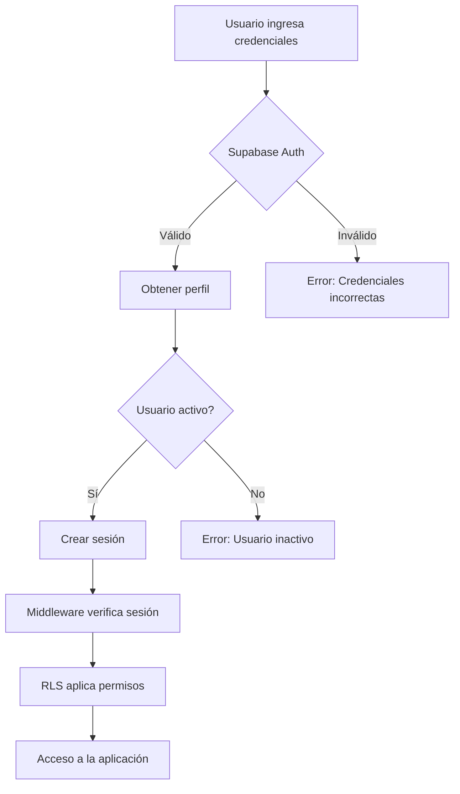

# Flujo de Autenticación

Sistema de autenticación con Supabase Auth y control de acceso basado en roles.

## Arquitectura de Autenticación

```
Usuario → Supabase Auth → Next.js Middleware → Aplicación
                ↓
            Profiles Table (roles)
                ↓
            Row Level Security
```

## Roles del Sistema

### Admin
**Permisos:**
- ✅ Crear, ver, editar y eliminar cuentas
- ✅ Crear, ver, editar y eliminar categorías
- ✅ Crear y ver movimientos
- ✅ Anular movimientos
- ✅ Ver dashboard global
- ✅ Exportar datos
- ✅ Gestionar usuarios

### Usuario
**Permisos:**
- ✅ Crear y ver movimientos
- ✅ Ver cuentas activas (solo lectura)
- ✅ Ver categorías activas (solo lectura)
- ✅ Ver dashboard
- ✅ Exportar movimientos
- ❌ No puede eliminar cuentas ni categorías
- ❌ No puede anular movimientos
- ❌ No puede gestionar usuarios

## Flujo de Login

```typescript
// 1. Usuario ingresa credenciales
async function login(email: string, password: string) {
  const { data, error } = await supabase.auth.signInWithPassword({
    email,
    password,
  })
  
  if (error) {
    throw new Error('Credenciales inválidas')
  }
  
  // 2. Obtener perfil del usuario
  const { data: profile } = await supabase
    .from('profiles')
    .select('*')
    .eq('id', data.user.id)
    .single()
  
  if (!profile || !profile.activo) {
    await supabase.auth.signOut()
    throw new Error('Usuario inactivo')
  }
  
  // 3. Redirigir al dashboard
  router.push('/dashboard')
}
```

## Flujo de Logout

```typescript
async function logout() {
  const { error } = await supabase.auth.signOut()
  
  if (error) {
    throw new Error('Error al cerrar sesión')
  }
  
  // Redirigir al login
  router.push('/login')
}
```

## Middleware de Next.js

```typescript
// middleware.ts
import { createMiddlewareClient } from '@supabase/auth-helpers-nextjs'
import { NextResponse } from 'next/server'
import type { NextRequest } from 'next/server'

export async function middleware(req: NextRequest) {
  const res = NextResponse.next()
  const supabase = createMiddlewareClient({ req, res })

  // Verificar sesión
  const {
    data: { session },
  } = await supabase.auth.getSession()

  // Rutas públicas
  const isPublicRoute = req.nextUrl.pathname.startsWith('/login')

  // Si no hay sesión y la ruta es protegida
  if (!session && !isPublicRoute) {
    return NextResponse.redirect(new URL('/login', req.url))
  }

  // Si hay sesión y está en login, redirigir a dashboard
  if (session && isPublicRoute) {
    return NextResponse.redirect(new URL('/', req.url))
  }

  return res
}

export const config = {
  matcher: ['/((?!_next/static|_next/image|favicon.ico).*)'],
}
```

## Protección de Rutas en Componentes

```typescript
// app/(dashboard)/layout.tsx
import { createServerComponentClient } from '@supabase/auth-helpers-nextjs'
import { cookies } from 'next/headers'
import { redirect } from 'next/navigation'

export default async function DashboardLayout({
  children,
}: {
  children: React.ReactNode
}) {
  const supabase = createServerComponentClient({ cookies })

  const {
    data: { session },
  } = await supabase.auth.getSession()

  if (!session) {
    redirect('/login')
  }

  // Obtener perfil del usuario
  const { data: profile } = await supabase
    .from('profiles')
    .select('*')
    .eq('id', session.user.id)
    .single()

  if (!profile || !profile.activo) {
    redirect('/login')
  }

  return (
    <div>
      {/* Sidebar, Navbar, etc */}
      {children}
    </div>
  )
}
```

## Hook de Usuario Actual

```typescript
// lib/hooks/use-user.ts
import { useEffect, useState } from 'react'
import { createClientComponentClient } from '@supabase/auth-helpers-nextjs'
import type { User } from '@supabase/supabase-js'

interface Profile {
  id: string
  email: string
  nombre_completo: string | null
  rol: 'admin' | 'usuario'
  activo: boolean
}

export function useUser() {
  const [user, setUser] = useState<User | null>(null)
  const [profile, setProfile] = useState<Profile | null>(null)
  const [loading, setLoading] = useState(true)
  const supabase = createClientComponentClient()

  useEffect(() => {
    // Obtener usuario actual
    const getUser = async () => {
      const {
        data: { user },
      } = await supabase.auth.getUser()

      setUser(user)

      if (user) {
        // Obtener perfil
        const { data: profile } = await supabase
          .from('profiles')
          .select('*')
          .eq('id', user.id)
          .single()

        setProfile(profile)
      }

      setLoading(false)
    }

    getUser()

    // Suscribirse a cambios de autenticación
    const {
      data: { subscription },
    } = supabase.auth.onAuthStateChange((_event, session) => {
      setUser(session?.user ?? null)
      if (!session?.user) {
        setProfile(null)
      }
    })

    return () => subscription.unsubscribe()
  }, [supabase])

  return {
    user,
    profile,
    loading,
    isAdmin: profile?.rol === 'admin',
    isUsuario: profile?.rol === 'usuario',
  }
}
```

## Protección de Acciones por Rol

```typescript
// Ejemplo: Solo admin puede anular movimientos
async function anularMovimiento(movimientoId: string, motivo: string) {
  const { profile } = useUser()

  if (profile?.rol !== 'admin') {
    throw new Error('No tienes permisos para anular movimientos')
  }

  const { error } = await supabase.rpc('anular_movimiento', {
    p_movimiento_id: movimientoId,
    p_motivo: motivo,
  })

  if (error) throw error
}
```

## Componente de Protección por Rol

```typescript
// components/auth/role-guard.tsx
import { useUser } from '@/lib/hooks/use-user'
import { ReactNode } from 'react'

interface RoleGuardProps {
  children: ReactNode
  allowedRoles: ('admin' | 'usuario')[]
  fallback?: ReactNode
}

export function RoleGuard({ children, allowedRoles, fallback }: RoleGuardProps) {
  const { profile, loading } = useUser()

  if (loading) {
    return <div>Cargando...</div>
  }

  if (!profile || !allowedRoles.includes(profile.rol)) {
    return fallback || null
  }

  return <>{children}</>
}

// Uso:
<RoleGuard allowedRoles={['admin']}>
  <button onClick={anularMovimiento}>Anular</button>
</RoleGuard>
```

## Creación de Usuario (Solo Admin)

```typescript
// Solo admin puede crear usuarios
async function crearUsuario(
  email: string,
  password: string,
  nombreCompleto: string,
  rol: 'admin' | 'usuario'
) {
  // Verificar que el usuario actual es admin
  const { profile } = useUser()
  if (profile?.rol !== 'admin') {
    throw new Error('No tienes permisos para crear usuarios')
  }

  // 1. Crear usuario en Supabase Auth
  const { data: authData, error: authError } = await supabase.auth.admin.createUser({
    email,
    password,
    email_confirm: true,
  })

  if (authError) throw authError

  // 2. Crear perfil
  const { error: profileError } = await supabase.from('profiles').insert({
    id: authData.user.id,
    email,
    nombre_completo: nombreCompleto,
    rol,
    activo: true,
  })

  if (profileError) throw profileError

  return authData.user
}
```

## Trigger para Crear Perfil Automáticamente

```sql
-- Este trigger se ejecuta cuando se crea un usuario en auth.users
-- y crea automáticamente un perfil en la tabla profiles

CREATE OR REPLACE FUNCTION public.handle_new_user()
RETURNS TRIGGER AS $$
BEGIN
  INSERT INTO public.profiles (id, email, rol)
  VALUES (
    NEW.id,
    NEW.email,
    'usuario' -- Por defecto, todos los nuevos usuarios son 'usuario'
  );
  RETURN NEW;
END;
$$ LANGUAGE plpgsql SECURITY DEFINER;

CREATE TRIGGER on_auth_user_created
  AFTER INSERT ON auth.users
  FOR EACH ROW EXECUTE FUNCTION public.handle_new_user();
```

## Variables de Entorno

```bash
# .env.local
NEXT_PUBLIC_SUPABASE_URL=https://your-project.supabase.co
NEXT_PUBLIC_SUPABASE_ANON_KEY=your-anon-key
SUPABASE_SERVICE_ROLE_KEY=your-service-role-key # Solo para admin operations
```

## Flujo Completo de Autenticación



## Seguridad

### Mejores Prácticas

1. **Nunca exponer service_role_key en el cliente**
   - Solo usar en server-side
   - Solo para operaciones admin

2. **Usar RLS para control de acceso**
   - No confiar solo en el frontend
   - Las políticas RLS son la última línea de defensa

3. **Validar rol en cada operación crítica**
   - Verificar permisos en el backend
   - No confiar en el estado del cliente

4. **Usar HTTPS en producción**
   - Siempre usar conexiones seguras
   - Configurar CORS correctamente

5. **Implementar rate limiting**
   - Prevenir ataques de fuerza bruta
   - Limitar intentos de login

## Recuperación de Contraseña

```typescript
async function resetPassword(email: string) {
  const { error } = await supabase.auth.resetPasswordForEmail(email, {
    redirectTo: `${window.location.origin}/auth/reset-password`,
  })

  if (error) throw error
}

// En la página de reset
async function updatePassword(newPassword: string) {
  const { error } = await supabase.auth.updateUser({
    password: newPassword,
  })

  if (error) throw error
}
```
