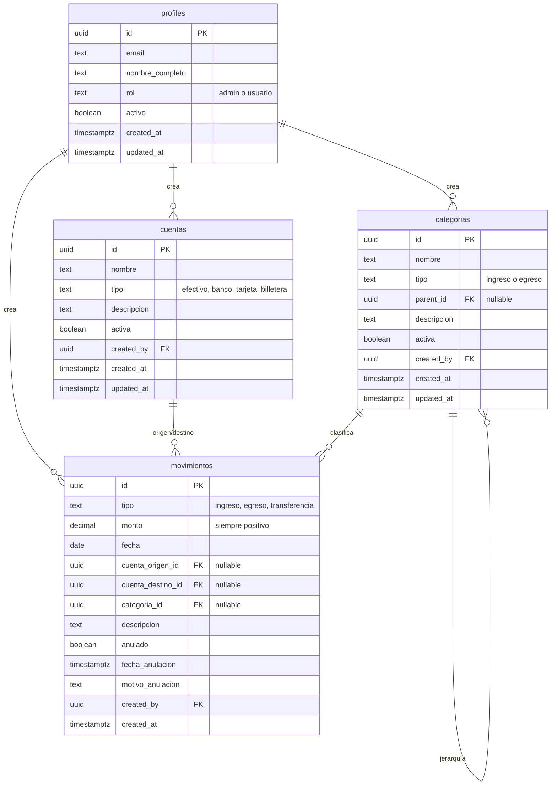
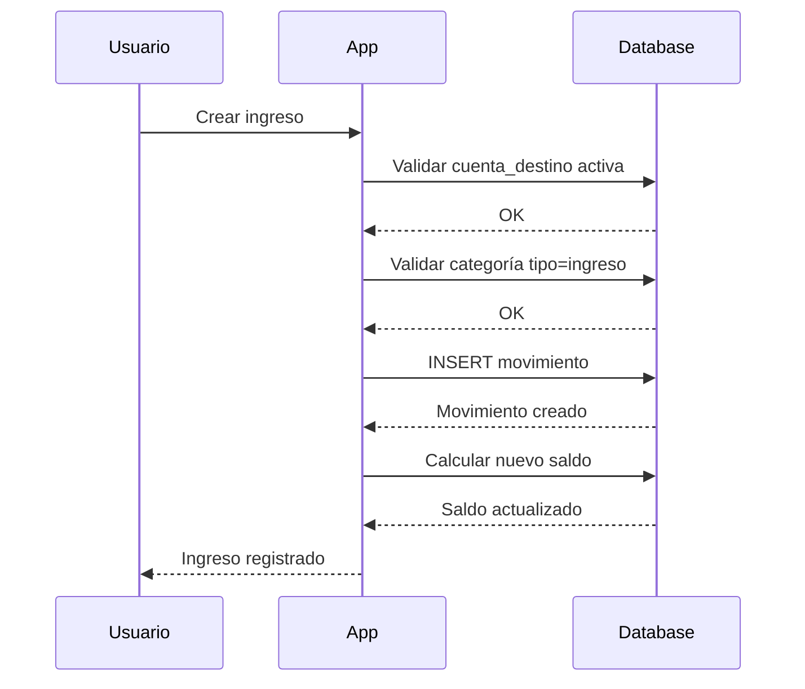
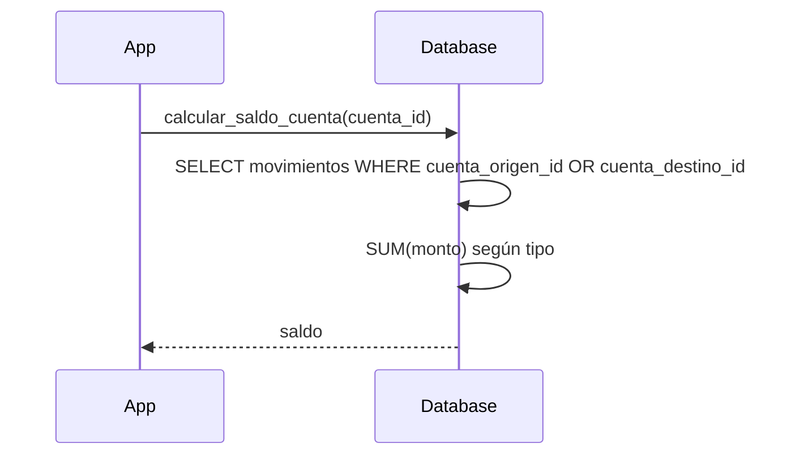

# Diagrama de Base de Datos

Modelo entidad-relación del Sistema de Control Financiero.

## Diagrama ER



## Relaciones Detalladas

### profiles → movimientos
- **Tipo**: Uno a muchos
- **Descripción**: Un usuario puede crear múltiples movimientos
- **Campo**: `movimientos.created_by` → `profiles.id`
- **Regla**: NOT NULL (todo movimiento debe tener un creador)

### profiles → cuentas
- **Tipo**: Uno a muchos
- **Descripción**: Un usuario puede crear múltiples cuentas
- **Campo**: `cuentas.created_by` → `profiles.id`
- **Regla**: Nullable (para cuentas creadas automáticamente)

### profiles → categorias
- **Tipo**: Uno a muchos
- **Descripción**: Un usuario puede crear múltiples categorías
- **Campo**: `categorias.created_by` → `profiles.id`
- **Regla**: Nullable (para categorías predefinidas)

### cuentas → movimientos (origen)
- **Tipo**: Uno a muchos
- **Descripción**: Una cuenta puede ser origen de múltiples movimientos
- **Campo**: `movimientos.cuenta_origen_id` → `cuentas.id`
- **Regla**: Nullable (solo para egresos y transferencias)

### cuentas → movimientos (destino)
- **Tipo**: Uno a muchos
- **Descripción**: Una cuenta puede ser destino de múltiples movimientos
- **Campo**: `movimientos.cuenta_destino_id` → `cuentas.id`
- **Regla**: Nullable (solo para ingresos y transferencias)

### categorias → movimientos
- **Tipo**: Uno a muchos
- **Descripción**: Una categoría puede clasificar múltiples movimientos
- **Campo**: `movimientos.categoria_id` → `categorias.id`
- **Regla**: Nullable (solo para transferencias)

### categorias → categorias (auto-relación)
- **Tipo**: Uno a muchos (jerárquica)
- **Descripción**: Una categoría puede tener subcategorías
- **Campo**: `categorias.parent_id` → `categorias.id`
- **Regla**: Nullable (categorías raíz no tienen parent)

## Constraints Importantes

### Movimientos - Validación por Tipo

```sql
-- INGRESO: solo cuenta_destino
CHECK (tipo != 'ingreso' OR (cuenta_origen_id IS NULL AND cuenta_destino_id IS NOT NULL))

-- EGRESO: solo cuenta_origen
CHECK (tipo != 'egreso' OR (cuenta_origen_id IS NOT NULL AND cuenta_destino_id IS NULL))

-- TRANSFERENCIA: ambas cuentas, deben ser diferentes
CHECK (tipo != 'transferencia' OR (cuenta_origen_id IS NOT NULL AND cuenta_destino_id IS NOT NULL AND cuenta_origen_id != cuenta_destino_id))

-- Categoría requerida para ingreso/egreso, opcional para transferencia
CHECK (tipo = 'transferencia' OR categoria_id IS NOT NULL)
```

### Validaciones Generales

```sql
-- Monto siempre positivo
CHECK (monto > 0)

-- Tipo válido
CHECK (tipo IN ('ingreso', 'egreso', 'transferencia'))

-- Rol válido
CHECK (rol IN ('admin', 'usuario'))

-- Tipo de cuenta válido
CHECK (tipo IN ('efectivo', 'banco', 'tarjeta', 'billetera'))

-- Tipo de categoría válido
CHECK (tipo IN ('ingreso', 'egreso'))
```

## Índices para Optimización

### Índices en movimientos (tabla más consultada)

```sql
-- Por fecha (para reportes por período)
CREATE INDEX idx_movimientos_fecha ON movimientos(fecha DESC);

-- Por tipo (para filtrar ingresos/egresos)
CREATE INDEX idx_movimientos_tipo ON movimientos(tipo);

-- Por estado (para excluir anulados)
CREATE INDEX idx_movimientos_anulado ON movimientos(anulado);

-- Por cuenta origen (para cálculo de saldos)
CREATE INDEX idx_movimientos_cuenta_origen ON movimientos(cuenta_origen_id) 
WHERE cuenta_origen_id IS NOT NULL;

-- Por cuenta destino (para cálculo de saldos)
CREATE INDEX idx_movimientos_cuenta_destino ON movimientos(cuenta_destino_id) 
WHERE cuenta_destino_id IS NOT NULL;

-- Por categoría (para reportes)
CREATE INDEX idx_movimientos_categoria ON movimientos(categoria_id);

-- Compuesto para reportes por período
CREATE INDEX idx_movimientos_fecha_tipo_anulado ON movimientos(fecha, tipo, anulado);
```

### Índices en otras tablas

```sql
-- Cuentas activas
CREATE INDEX idx_cuentas_activa ON cuentas(activa);

-- Categorías activas
CREATE INDEX idx_categorias_activa ON categorias(activa);

-- Jerarquía de categorías
CREATE INDEX idx_categorias_parent ON categorias(parent_id);

-- Rol de usuarios
CREATE INDEX idx_profiles_rol ON profiles(rol);
```

## Flujo de Datos

### Crear Ingreso



### Calcular Saldo de Cuenta



## Ejemplos de Datos

### Ejemplo: Ingreso

```sql
INSERT INTO movimientos (
    tipo, monto, fecha,
    cuenta_destino_id, categoria_id,
    descripcion, created_by
) VALUES (
    'ingreso', 150000, '2024-12-14',
    'uuid-caja-chica', 'uuid-servicios',
    'Manicure completo', 'uuid-usuario'
);
```

### Ejemplo: Egreso

```sql
INSERT INTO movimientos (
    tipo, monto, fecha,
    cuenta_origen_id, categoria_id,
    descripcion, created_by
) VALUES (
    'egreso', 50000, '2024-12-14',
    'uuid-banco', 'uuid-insumos',
    'Compra de esmaltes', 'uuid-usuario'
);
```

### Ejemplo: Transferencia

```sql
INSERT INTO movimientos (
    tipo, monto, fecha,
    cuenta_origen_id, cuenta_destino_id,
    descripcion, created_by
) VALUES (
    'transferencia', 100000, '2024-12-14',
    'uuid-caja-chica', 'uuid-banco',
    'Depósito bancario', 'uuid-usuario'
);
```

## Cálculo de Saldos

### Saldo de Cuenta

```
Saldo = 
  + SUM(monto) WHERE tipo='ingreso' AND cuenta_destino_id = cuenta_id
  - SUM(monto) WHERE tipo='egreso' AND cuenta_origen_id = cuenta_id
  + SUM(monto) WHERE tipo='transferencia' AND cuenta_destino_id = cuenta_id
  - SUM(monto) WHERE tipo='transferencia' AND cuenta_origen_id = cuenta_id
  
  (solo movimientos con anulado = false)
```

### Saldo Total

```
Saldo Total = SUM(calcular_saldo_cuenta(id)) 
              FROM cuentas 
              WHERE activa = true
```

### Resultado del Período

```
Resultado = 
  SUM(monto) WHERE tipo='ingreso' AND fecha BETWEEN inicio AND fin
  - SUM(monto) WHERE tipo='egreso' AND fecha BETWEEN inicio AND fin
  
  (las transferencias NO se cuentan)
  (solo movimientos con anulado = false)
```

## Consideraciones de Rendimiento

1. **Cálculo de saldos**: Se hace dinámicamente, no se almacena
   - Ventaja: Siempre preciso, no hay inconsistencias
   - Desventaja: Requiere cálculo cada vez
   - Mitigación: Índices optimizados, cache en frontend

2. **Movimientos inmutables**: Solo se anulan, no se eliminan
   - Ventaja: Auditoría completa, trazabilidad
   - Desventaja: Tabla crece indefinidamente
   - Mitigación: Archivado periódico de movimientos antiguos

3. **Soft deletes**: Cuentas y categorías se desactivan
   - Ventaja: No rompe referencias históricas
   - Desventaja: Más registros en queries
   - Mitigación: Filtrar por `activa = true` en queries frecuentes

4. **RLS**: Políticas de seguridad en cada query
   - Ventaja: Seguridad a nivel de base de datos
   - Desventaja: Overhead en cada query
   - Mitigación: Políticas optimizadas, índices apropiados
